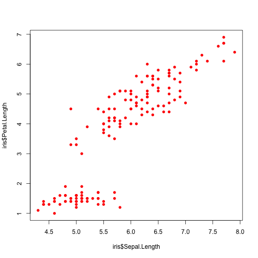

Base graphics in R
=============================================================

Author: Emily Davenport

## Description

In this short 20 minute class we will explore some of the built in graph options in R. These tools are useful for data exploration and visualization. There are likely better options for building good looking figures for publications or presentations, however, using the built in graphic options is a great way to get a first pass look at your data.  

**Learning objectives:**

There are two goals for this short lesson: 
1. Be able to have a broad sense for the kinds of graphics are can do straight out of the box. 
2. Feel comfortable in reading the R help material to be able to use these tools effectively.

## Get familiar with the data

Today we are going to work with the iris dataset, which contains anatomic measurements and species classifications.  


```r
`?`(iris)

dim(iris)
```


```
## [1] 150   5
```


```r
head(iris)
```


```
##   Sepal.Length Sepal.Width Petal.Length Petal.Width Species
## 1          5.1         3.5          1.4         0.2  setosa
## 2          4.9         3.0          1.4         0.2  setosa
## 3          4.7         3.2          1.3         0.2  setosa
## 4          4.6         3.1          1.5         0.2  setosa
## 5          5.0         3.6          1.4         0.2  setosa
## 6          5.4         3.9          1.7         0.4  setosa
```


```r

table(iris$Species)
```


```
## 
##     setosa versicolor  virginica 
##         50         50         50 
```


### Scatterplots

plot(x,y,...)   # plots an x-y scatterplot
    col     color of points
    pch     shape of points
    main    title of plot
    xlab    label of x-axis
    ylab    label of y-axis

points(x,y,...) # plots an x-y scatterplot on top of another plot

abline()
    a       intercept
    b       slope
    h       y-value for horizontal line
    v       x-value for vertical line
    


```r
`?`(plot)

plot(iris$Sepal.Length, iris$Petal.Length)
```

 

```r

# Make the points red:
plot(iris$Sepal.Length, iris$Petal.Length, col = "red")
```

 

```r

# Make the points a closed circle:
plot(iris$Sepal.Length, iris$Petal.Length, col = "red", pch = 16)
```

 

```r

# Add a title:
plot(iris$Sepal.Length, iris$Petal.Length, col = "red", pch = 16, 
    main = "Relationship of sepal length to petal length")
```

 

```r

# Add a newline character so title doesn't run off the page:
plot(iris$Sepal.Length, iris$Petal.Length, col = "red", pch = 16, 
    main = "Relationship of sepal length to petal length:\n a case study in botanical excellence")
```

 

```r

# Add labels to the axes:
plot(iris$Sepal.Length, iris$Petal.Length, col = "red", pch = 16, 
    main = "Relationship of sepal length to petal length:\n a case study in botanical excellence", 
    xlab = "sepal length (cm)", ylab = "petal length (cm)")

# Add line:
`?`(abline)

abline(h = 3, col = "gray")
```

 


## Histograms
 
hist(x,...) 
    x       data
    breaks  the number of bins in the histogram 
    col     color of bins
    main    title of plot
    xlab    label of x-axis


```r
`?`(hist)

# Plot distribution of petal lengths in the data:
hist(iris$Petal.Length)
```

 

```r

# Make the bin size smaller for finer resolution:
hist(iris$Petal.Length, breaks = 50)
```

 

```r

# Add a title, x-axis label, and color to histogram:
hist(iris$Petal.Length, breaks = 50, col = "tomato", main = "Distribution of Petal lengths, all species", 
    xlab = "petal length (cm)")
```

 


## Boxplots

boxplot(x,...)
    x       data
    col     color of boxes
    xlab    label of x-axis
    ylab    label of y-axis
    main    title of plot
    boxwex  sizing of the boxes
    names   the names of each factor in the boxplot

stripchart(x ~ y, ...)
    x           data
    y           factor dividing data by
    vertical    if you'd like the boxes being vertical (=TRUE)
    method      either "jitter", "overplot", or "stack"
    pch         point shape
    col         colors of points
    


```r
`?`(boxplot)

# Plot boxplots of the length of the petals by the species of plant:
boxplot(iris$Petal.Length ~ iris$Species)
```

 

```r

# Add colors to the boxes:
boxplot(iris$Petal.Length ~ iris$Species, col = c("red", "gray", 
    "blue"))
```

 

```r

# Add a title, x- and y- axes labels:
boxplot(iris$Petal.Length ~ iris$Species, col = c("red", "gray", 
    "blue"), xlab = "Species", ylab = "petal length (cm)", main = "Petal length as a function of species")
```

 

```r

`?`(stripchart)

stripchart(iris$Petal.Length ~ iris$Species, vertical = TRUE)
```

 

```r

# Add jitter to the points, make them full circles, and add color to the
# points:
stripchart(iris$Petal.Length ~ iris$Species, vertical = TRUE, method = "jitter", 
    pch = 16, col = c("red", "gray", "blue"))
# Add a boxplot overlay and make the boxes the same width as the jitter:
boxplot(iris$Petal.Length ~ iris$Species, add = TRUE, boxwex = 0.35, 
    names = c(" ", " ", " "))
```

 


## Saving graph
pdf(file="Rplots.pdf")
    file    name of file to save to
    width   width of file in inches
    height  height of file in inches
    


```r
# 2 ways:

# 1 either export in R studio or save pdf in quartz 2 save in code:
`?`(pdf)

# Open graphics device with the name you'd like the file to be saved to:
pdf("amazing_petal_length_differences_112113ERD.pdf")

# Plot anything you'd like plotted:
stripchart(iris$Petal.Length ~ iris$Species, vertical = TRUE, method = "jitter", 
    pch = 16, col = c("red", "gray", "blue"))
boxplot(iris$Petal.Length ~ iris$Species, add = TRUE, boxwex = 0.35, 
    notch = TRUE, names = c(" ", " ", " "))

# Close device:
dev.off()
```


```
## pdf 
##   2 
```


## More complicated options (par)

legend(x, legend, fill, ...)
    x       location of legend on plot
    legend  the text of the legend
    fill    the color of the legend values

par(...)
    mfrow   the layout of plots by row


```r
# Want to color points on scatter plot by what species they belong to.
# First, write a function that returns a specific color based on the
# species name:
color_my_plants_yo <- function(species) {
    if (species == "setosa") {
        return("red")
    }
    if (species == "versicolor") {
        return("gray")
    }
    if (species == "virginica") {
        return("blue")
    }
}

# Plot the scatterplot, applying the color function to the data:
plot(iris$Sepal.Length, iris$Petal.Length, col = sapply(iris$Species, 
    color_my_plants_yo), pch = 16, main = "Relationship of sepal length to petal length:\n a case study", 
    xlab = "sepal length (cm)", ylab = "petal length (cm)")

# Add a legend
`?`(legend)

legend("bottomright", legend = c("setosa", "versicolor", "virginica"), 
    fill = c("red", "gray", "blue"))
```

 

```r

`?`(par)

# Open up graphics divice:
pdf("two_amazing_plots_112113ERD.pdf", width = 10, height = 5)

# set the parameters of the plot: want to have two plots on the same page,
# side by side:
par(mfrow = c(1, 2))

# Plot the scatterplot of sepal length to petal length and legend, colored
# by species:
plot(iris$Sepal.Length, iris$Petal.Length, col = sapply(iris$Species, 
    color_my_plants_yo), pch = 16, main = "Relationship of sepal length to petal length:\n a case study", 
    xlab = "sepal length (cm)", ylab = "petal length (cm)")
legend("bottomright", legend = c("setosa", "versicolor", "virginica"), 
    fill = c("red", "gray", "blue"))

# Plot the boxplot of the petal length by species:
stripchart(iris$Petal.Length ~ iris$Species, vertical = TRUE, method = "jitter", 
    pch = 16, col = c("red", "gray", "blue"), main = "Petal length by species", 
    xlab = "species", ylab = "petal length (cm)")
boxplot(iris$Petal.Length ~ iris$Species, add = TRUE, boxwex = 0.35, 
    notch = TRUE, names = c(" ", " ", " "))

# Turn the device off:
dev.off()
```


```
## pdf 
##   2 
```


```r

```


## More graphics!!

ggplot2
lattice

